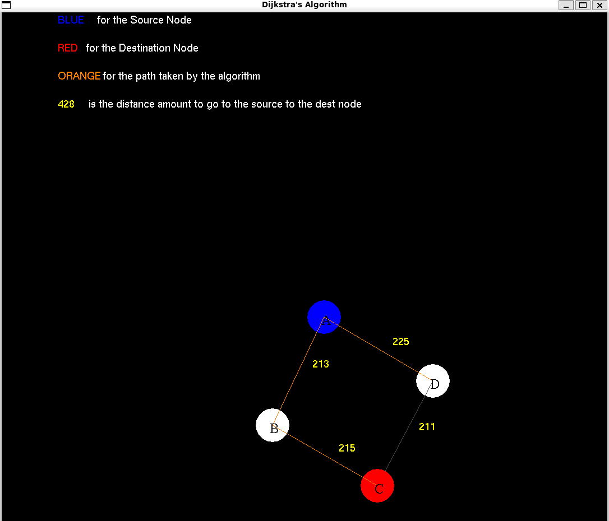

<h1 align="center">Dijkstra Visualizer</h1>

<div align="center">
 


</div>

A Dijkstra's Algorithm Visualizer written in C using OpenGL graphics library.

<figure align="center">
    
</figure>

## Dependencies 

- Linux (Ubuntu) 

```bash
$ sudo apt-get install freeglut3-dev

```

## Execute 

- Linux 

```bash
$ make

```
- Docker

To run the GUI application using Docker from WSL in Windows, make sure to have docker installed and also garantee that the user's inside the docker group. 


If you are in WSL, you can run the command below:

```bash
$ docker build -t dijkstra .
$ docker run -it -v /tmp/.X11-unix:/tmp/.X11-unix \
                    -v /mnt/wslg:/mnt/wslg \
                    -e DISPLAY \
                    -e WAYLAND_DISPLAY \
                    -e XDG_RUNTIME_DIR \
                    -e PULSE_SERVER \
                    dijkstra

```

Otherwise, you can run the command to set up the display enviroment:

```bash
$ docker build -t dijkstra .
$ docker run -it --rm -v /tmp/.X11-unix:/tmp/.X11-unix \
                        -e DISPLAY \
                        -e WAYLAND_DISPLAY \
                        -e XDG_RUNTIME_DIR \
                        -e PULSE_SERVER \
                        dijkstra
```

Sooner it will be built djikstra in a docker container image to be executable in any OS. 

> Made with :gift\_heart: by @marcos-c1 
